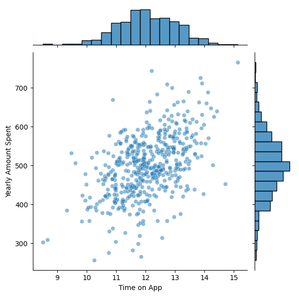
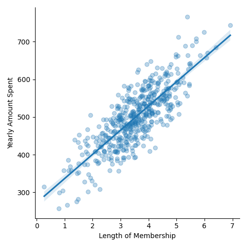
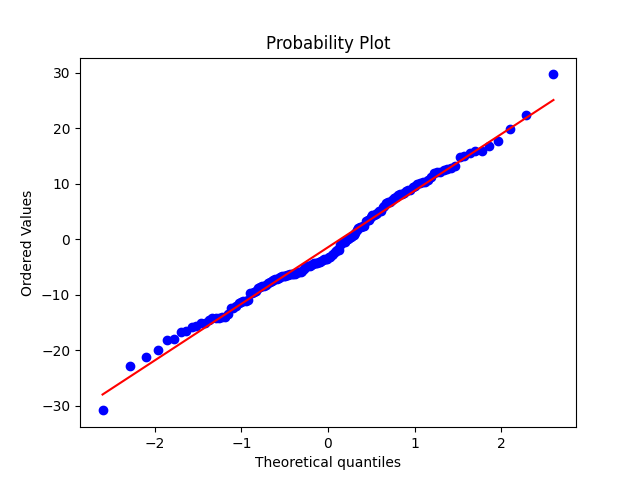

# E-Commerce Project Analysis

## Project Goal
The primary objective of this project was to learn and apply Linear Regression to a real-world dataset. Through this analysis, I aimed to understand the fundamental concepts of Linear Regression and how it can be utilized to interpret customer behaviors and inform business decisions.

## Overview
This project analyzes customer behavior data from an online clothing store to help the company decide whether to focus their efforts on enhancing the mobile app experience or the website. The dataset used in this analysis is sourced from Kaggle: [Focusing on Mobile App or Website](https://www.kaggle.com/datasets/kolawale/focusing-on-mobile-app-or-website).

## About the Dataset
The dataset comprises data from customers who buy clothes online after having sessions/meetings with a personal stylist in-store. It captures the essence of customers' choices, whether to order via a mobile app or website, post their in-store style and clothing advice sessions. This strategic dataset serves as a foundation for understanding and optimizing the online shopping experience tailored to customer preferences.

### Key Features
- **Avg. Session Length**: Average session of in-store style advice sessions.
- **Time on App**: Time spent on the app in minutes.
- **Time on Website**: Time spent on the website in minutes.
- **Length of Membership**: How many years the customer has been a member.
- **Yearly Amount Spent**: The total amount of money spent by the customer in a year.

## Analysis Insights
A critical part of our analysis focused on identifying correlations between different features and the 'Yearly Amount Spent'. Notably, we discovered significant correlations indicating:
- A strong relationship between **'Time on App'** and **'Yearly Amount Spent'**.
- A profound linkage between **'Length of Membership'** and **'Yearly Amount Spent'**.

These findings suggest that both the mobile app usage and the length of customer membership play crucial roles in the annual expenditure of customers, guiding the company's strategic decisions on investment and improvement areas.

### Example Images

## Probability Plot Analysis
The probability plot, specifically the Q-Q (quantile-quantile) plot, was utilized to assess how the data's distribution compared against a theoretically expected distribution (in this case, the normal distribution). This analysis helps in understanding the distribution of residuals from our linear regression model, ensuring the assumptions behind linear regression are met.

The Q-Q plot analysis provided valuable insights into the normality of residuals, indicating the appropriateness of linear regression for our data and highlighting any potential anomalies or outliers in the dataset.

## Conclusion
Through detailed exploratory data analysis and linear regression modeling, this project aids the e-commerce company in making an informed decision on whether to concentrate efforts on enhancing the mobile app or website. The significant correlations discovered offer a clear direction for focusing on the mobile app and leveraging membership length to boost yearly spending among customers. The project also served as a practical application to learn Linear Regression, demonstrating its power in drawing meaningful insights from data.